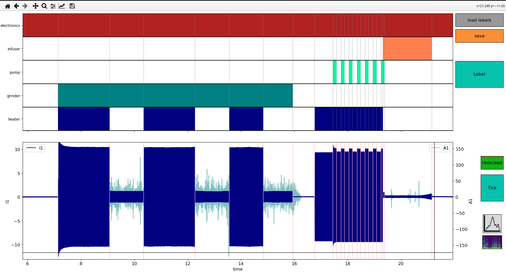

# timeseries-labelling-tool

A rudimentary matplotlib-based Graphical User Interface (GUI) to label multivariate time series. This labeller is suitable for multi-label clustering/disaggregation applications.

This labeller works well with big data (tested with up to $`10^7`$ data points).



## Installation

```bash
conda env create -f environment.yml
pip install -e .
```

## Requirements
* matplotlib
* mplcursors
* seaborn
* pandas
* dask
* pyarrow
* scikit_learn
* scipy
* numpy

## Run the demo

```bash
cd scripts
python label.py
```

**Basic use:**

Load a dataframe within the script, initialise the labeller as shown in `scripts/label.py`, then use the labeller as follows:

- [ ] Left click on the time series to add or remove ticks (vertical separators);
- [ ] Left click on the labels to set or remove the presence of a label between two timestamps;
- [ ] Right click to lock/unlock ticking/unticking action (shortcut to the Lock/Unlock button).

Options:
- [ ] Save button: save the current labels (as a pickle file).
- [ ] Load labels button: load labels from a pickle checkpoint (`.pkl`);
- [ ] Label button: lock or unlock labelling action on the upper plot;
- [ ] Lock button: lock or unlock x-axis ticking or unticking on the lower plot (alternatively: right click);
- [ ] Tick button: enable ticking (add a vertical separator) or unticking (remove the closest vertical separator) actions;
- [ ] Time series button: switch between input data (if multiple dataframes were provided);
- [ ] Spectrogram button: visualise the spectrogram of each time series.